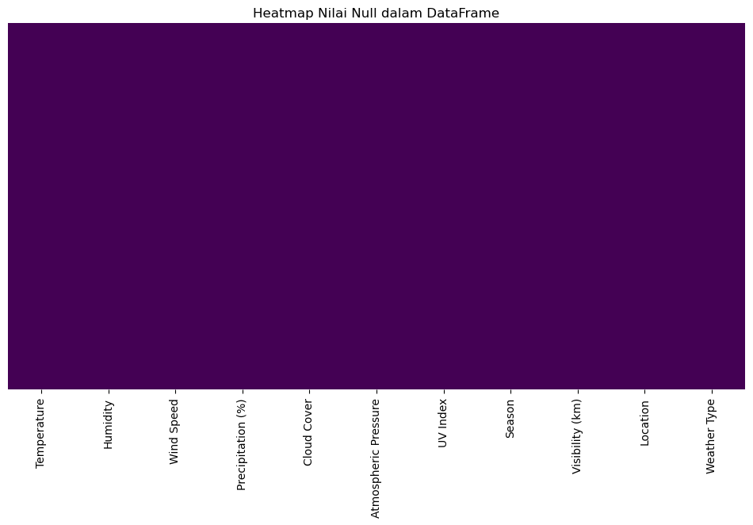
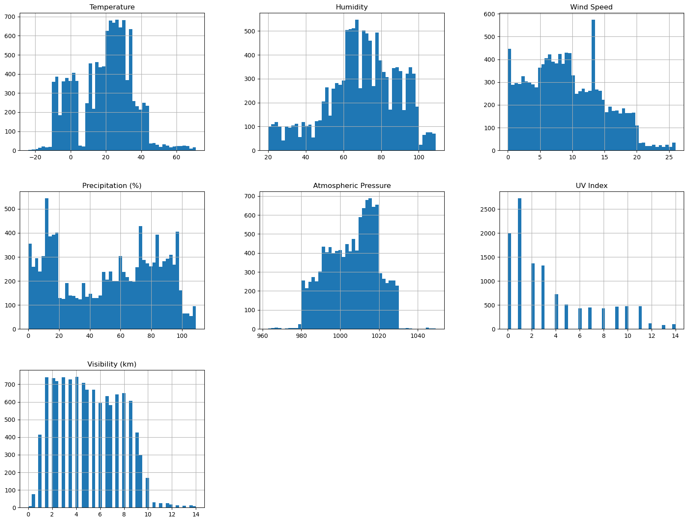
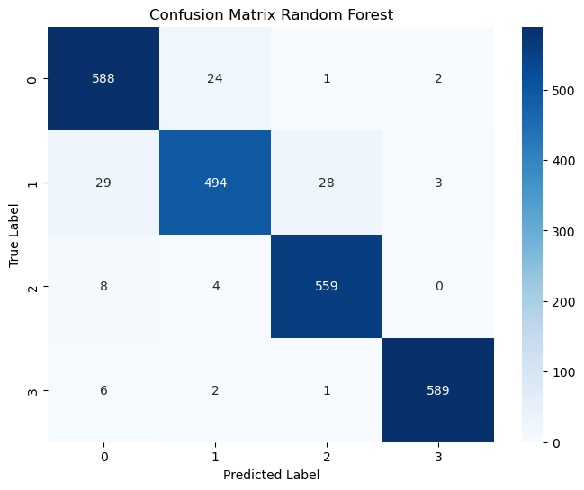

# Laporan Proyek Machine Learning - Hardatama Rakha Ugraha

## Domain Proyek

**Latar Belakang :**

Cuaca memainkan peran penting dalam berbagai aspek kehidupan manusia, mulai dari perencanaan kegiatan harian hingga sektor industri seperti pertanian, transportasi, dan pariwisata. Kemampuan untuk memprediksi jenis cuaca secara akurat memungkinkan pengambilan keputusan yang lebih baik dan lebih efisien. Salah satu pendekatan yang umum digunakan untuk mendukung prediksi cuaca adalah melalui pemanfaatan algoritma machine learning.

\
**Mengapa dan Bagaimana Masalah Ini Harus Diselesaikan?**

Prediksi tipe cuaca yang akurat bisa menjadi komponen penting dalam sistem peringatan dini atau aplikasi mobil cuaca. Menyelesaikan masalah ini akan melibatkan beberapa tahap seperti eksplorasi data, pemilihan model, validasi, dan evaluasi dengan metrik yang tepat. Penyelesaian masalah ini juga menjadi sarana pembelajaran praktik terbaik dalam proyek machine learning nyata.

Menurut [Kowalski & Keeling, 2020], penggunaan machine learning untuk klasifikasi cuaca telah terbukti efektif dalam berbagai studi dan memungkinkan generalisasi yang lebih baik dibandingkan metode statistik tradisional.

> Referensi:
> Kowalski, J., & Keeling, R. (2020). Weather Classification with Machine Learning: A Review. International Journal of Climatology.
> DOI: https://doi.org/10.1002/joc.6510
## Business Understanding

**Problem Statements:**

1. Bagaimana cara mengklasifikasikan kondisi cuaca berdasarkan fitur-fitur seperti suhu, kelembaban, tekanan udara, dan lainnya?
2. Fitur apa saja yang berpengaruh dalam menentukan kondisi cuaca?

\
**Goals:**
1. Membangun model klasifikasi yang mampu memprediksi tipe cuaca (Rainy, Sunny, Cloudy, Snowy) berdasarkan input fitur cuaca.
2. Menerapkan teknik encoding lalu menggunakan correlation matrix untuk menilai seberapa berpengaruh fitur-fitur tersebut dengan fitur target.

\
**Solution Statements:**
1. Menggunakan beberapa algoritma machine learning untuk membandingkan performa klasifikasi, yaitu:
- K-Nearest Neighbors
- Decision Tree
- Random Forest
- AdaBoost
- Naive Bayes
2. Metrik evaluasi yang digunakan meliputi:
- Akurasi
- Presisi
- Recall
- F1-Score
- Confusion Matrix
## Data Understanding
Dataset yang digunakan bersifat sintetis dan tersedia dari platform Kaggle. 

Sumber dataset: https://www.kaggle.com/datasets/nikhil7280/weather-type-classification

**Fitur-fitur pada Dataset:**
| Fitur | Tipe | Deskripsi |
| ------ | ------ | ------ |
| Temperature | Numerik	| Suhu dalam °C (rentang luas: sangat dingin hingga sangat panas)|
|Humidity	| Numerik	|Kelembaban dalam % (termasuk >100% sebagai outlier)|
|Wind Speed	|Numerik|	Kecepatan angin dalam km/jam (mengandung nilai ekstrem/outlier)|
|Precipitation (%)|	Numerik|	Curah hujan dalam % (mengandung nilai ekstrem/outlier)|
|Cloud Cover	|Kategorikal	|Deskripsi tingkat tutupan awan (misal: clear, partly cloudy, overcast)|
|Atmospheric Pressure|	Numerik	|Tekanan udara dalam hPa (rentang luas)|
|UV Index	|Numerik|	Indeks radiasi UV|
|Season|	Kategorikal|	Musim saat data diambil (Spring, Summer, Autumn, Winter)|
|Visibility (km)	|Numerik|	Jarak pandang dalam km (bisa sangat rendah atau sangat tinggi)|
|Location	|Kategorikal|	Jenis lokasi (urban, rural, coastal, mountain, dll)|
|Weather Type	|Kategorikal|	Target klasifikasi: Cloudy, Rainy, Snowy, Sunny

Dataset terdiri dari 13200 baris yang mencakup berbagai fitur terkait cuaca dan mengkategorikan cuaca menjadi empat jenis: Cloudy, Rainy, Snowy, dan Sunny. Berikut ini adalah kondisi data sebelum dilakukan pembersihan:
- Jumlah nilai kosong (null) = 0
- Duplikat = 0
- Outlier = Terdapat pada fitur Temperature, Wind Speed, Atmospheric Pressure, dan Visibility (km)
Berikut adalah visualisasi heatmap nilai null, dan histogram sebaran awal:

\
**Exploratory Data Analysis (EDA)**

Analisis eksplorasi dilakukan untuk memahami distribusi data dan mendeteksi outlier. Outlier terdeteksi pada:
- Temperature (>70°C)
- Wind Speed (>25 km/jam)
- Atmospheric Pressure (<950 atau >1050 hPa)
- Visibility (>14 km)

Outlier ditangani menggunakan metode Interquartile Range (IQR).

Dilakukan juga Univariate Analysis yang menunjukkan distribusi fitur numerik dan proporsi fitur kategorikal, sementara Multivariate Analysis mengungkap hubungan antara fitur.
## Data Preparation

Tahap data preparation dilakukan untuk memastikan data siap digunakan dalam pelatihan model machine learning. Adapun langkah-langkah yang dilakukan adalah sebagai berikut:

1. Encoding Fitur Kategorikal
Dilakukan label encoding pada semua fitur kategorikal, termasuk target Weather Type, dengan mapping sebagai berikut:
- 0: Cloudy
- 1: Rainy
- 2: Snowy
- 3: Sunny
Encoding ini diperlukan agar model dapat memproses data kategorikal dalam bentuk numerik.

2. Feature Selection
Dilakukan analisis correlation matrix untuk mengidentifikasi fitur yang memiliki kontribusi rendah terhadap target. Berdasarkan hasil korelasi, fitur Temperature, Visibility (km), dan Location dihapus karena korelasinya sangat rendah terhadap Weather Type. Tahap ini penting untuk mengurangi noise dan meningkatkan efisiensi model.

3. Data Splitting
Data dibagi menjadi 80% data latih dan 20% data uji untuk memastikan model dapat dievaluasi dengan baik pada data yang belum pernah dilihat. Pembagian ini umum digunakan dalam eksperimen machine learning untuk menghindari overfitting.
## Modeling

Dalam tahap pemodelan, dilakukan pelatihan model menggunakan lima algoritma klasifikasi untuk membandingkan performa dan menentukan model terbaik:

1. K-Nearest Neighbors (KNN)

- Kelebihan: Sederhana, mudah diimplementasikan, dan efektif untuk dataset kecil.

- Kekurangan: Sensitif terhadap skala fitur dan nilai k. Performa menurun pada dataset besar.

2. Decision Tree

- Kelebihan: Mudah dipahami dan divisualisasikan, menangani data kategorikal dan numerikal.

- Kekurangan: Mudah overfitting jika tidak dilakukan pruning.

3. Random Forest

- Kelebihan: Mengatasi overfitting pada decision tree, robust terhadap noise dan outlier, serta mendukung fitur penting otomatis.

- Kekurangan: Kurang interpretatif dibanding pohon tunggal, lebih lambat saat pelatihan.

4. AdaBoost

- Kelebihan: Meningkatkan akurasi model lemah (weak learners), cukup efektif pada data bersih.

- Kekurangan: Sensitif terhadap outlier dan noise.

5. Naive Bayes

- Kelebihan: Cepat dan efisien untuk data besar.

- Kekurangan: Mengasumsikan fitur saling independen, yang jarang terjadi dalam kenyataan.

Setelah evaluasi terhadap kelima algoritma, Random Forest menunjukkan performa terbaik dalam hal akurasi dan generalisasi terhadap data uji. Oleh karena itu, model ini dipilih sebagai solusi akhir untuk klasifikasi Weather Type karena konsistensinya dalam menangani data dengan fitur numerik dan kategorikal serta ketahanannya terhadap outlier.
## Evaluation

**Metrik Evaluasi yang Digunakan**

Untuk mengevaluasi performa model klasifikasi cuaca, digunakan lima metrik evaluasi berikut:

1. Accuracy :
Persentase prediksi yang benar dibandingkan seluruh jumlah data.

Accuracy = 
(𝑇𝑃
+
𝑇𝑁)
/ 
(𝑇𝑃
+
𝑇𝑁
+
𝐹𝑃
+
𝐹𝑁)
 
Cocok digunakan saat distribusi kelas relatif seimbang.

2. Precision :
Proporsi prediksi positif yang benar-benar relevan.

Precision =
𝑇𝑃
/
(𝑇𝑃
+
𝐹𝑃)
​
 
Penting ketika biaya dari false positive besar.

3. Recall :
Proporsi data positif yang berhasil dikenali dengan benar.

Recall = 
𝑇𝑃
/
(𝑇𝑃
+
𝐹𝑁)

Penting saat false negative perlu diminimalkan.

4. F1-Score :
Rata-rata harmonik dari Precision dan Recall.

F1-Score =
(2
⋅
𝑃𝑟𝑒𝑐𝑖𝑠𝑖𝑜𝑛
⋅
𝑅𝑒𝑐𝑎𝑙𝑙)
/
(𝑃𝑟𝑒𝑐𝑖𝑠𝑖𝑜𝑛
+
𝑅𝑒𝑐𝑎𝑙𝑙)
​
 
Ideal saat diperlukan keseimbangan antara Precision dan Recall.

5. Confusion Matrix :
Matriks yang menunjukkan jumlah prediksi benar dan salah untuk setiap kelas.

\
**Hasil Evaluasi**

Berikut adalah hasil evaluasi dari lima algoritma yang diujikan:
| Model             | Accuracy  | Precision | Recall    | F1-Score  |
| ----------------- | --------- | --------- | --------- | --------- |
| KNN               | 0.867     | 0.865     | 0.864     | 0.864     |
| Decision Tree     | 0.938     | 0.937     | 0.937     | 0.937     |
| **Random Forest** | **0.954** | **0.954** | **0.953** | **0.953** |
| AdaBoost          | 0.908     | 0.907     | 0.906     | 0.906     |
| Naive Bayes       | 0.910     | 0.910     | 0.910     | 0.909     |

Berikut adalah confusion matrix dari model terbaik (Random Forest):

Interpretasi:
- Baris merepresentasikan label sebenarnya, kolom adalah prediksi model.
- Angka yang tinggi pada diagonal (588, 494, 559, 589) menunjukkan bahwa model berhasil memprediksi sebagian besar cuaca dengan benar.
- Angka di luar diagonal sangat kecil, menandakan kesalahan klasifikasi yang minim.

## Contact

If you have any questions, feel free to reach out to us at hardatama27@gmail.com.

Developed by Hardatama Rakha Ugraha - 2025